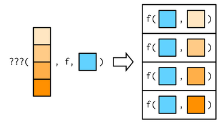

```{r setup, include=FALSE}
knitr::opts_chunk$set(echo = TRUE)
library(tidyverse)
library(furrr)
```

### Introduction

This document is me working through the functional programming section of Advanced R. I will be using the purrr package whenever possible and the furrr package to parallelize these operations when possible / reasonable. 

```{r}
# set default plan for future backend 
plan(multicore)
```


---------------------------------------------------------

Functional languages have **first-class functions**, which are functions that behave like any other data structure. In R this means we can do many things to them, such as assigning them to variables, storing them in lists, passing them as arguments to other functions, creating them inside functions, and returning them as results of a function. 
Many functional languages require functions to be **pure**. A function is pure if it satisfies 2 roperties: 

  - The output depends only on the inputs. Same inputs, same outputs. 
  - The function has no side effects, like changing the value of a global variable, writing to disk, or displaying to screen. 
  
Chapter 9 shows how to replace for loops with functionals (like map()) that take another function as an argument. 

Chapter 10 introduces function factories : functions that create functions. 

Chapter 11 shows how to create function operators:  functions that take functions as input and produce functions as output. They are like adverbs, because they typically modify the operation of a function. 

# Chapter 9 | Functionals 

A **functional** is a function that takes a function as an input and returns a vector as an output. 

```{r}
# simple functional example
randomize <- function(f){
  f(runif(1e3))
}

# call
randomize(mean)

randomize(sum)
```

## 9.2 | map()

`map(1:3, f)` is equivalent to `list(f(1), f(2), f(3))`

```{r}
triple <- function(x) x * 3

map(1:3, triple)
```

```{r}
# implementation of map 
simple_map <- function(x, f, ...){
  out <- vector("list", length(x))
  for (i in seq_along(x)){
    out[[i]] <- f(x[[i]], ...)
  }
  out
}
```

The real purrr::map is written in C, preserves names, and supports a few shortcuts. 

### 9.2.1 | Producing Atomic Vectors 

map() returns a list because lists are very general. We can return a simpler data structure with more specific map variants: 

```{r}
future_map_chr(mtcars, typeof)

future_map_lgl(mtcars, is.double)

n_unique <- function(x){length(unique(x))}
future_map_int(mtcars, n_unique)

future_map_dbl(mtcars, mean)
```

All map functions always return an output vector the same length as the input, which implies that each call to .f must return a single value. If not, it will return an error 

```{r}
pair <- function(x){c(x, x)}

# future_map_dbl(1:2, pair)
```

In this case, we can switch back to map as lists can accept any type of output: 

```{r}
future_map(1:2, pair)

future_map(1:2, as.character)
```

### 9.2.2 | Anonymous Functions and Shortcuts 

```{r}
# use a lambda 
future_map_dbl(mtcars, function(x) length(unique(x)))

# purrr shortcut 
future_map_dbl(mtcars, ~ length(unique(.x)))

# with pipes 
future_map_dbl(mtcars, ~ .x %>% unique %>% length)

# define lambda as a reusable function 
as_mapper(~ .x %>% unique %>% length)

# generate random data 
x <- future_map(1:1000, ~ 2 %>% runif)
```

A general rule of thumb is that if a function spans lines or uses {}, then its time to give it a name.

The map functions also have shortcuts for extracting elements from a vector, powered by purrr::pluck(). We can use a character vector to select elements by name, an integer vector to select by position, or a list to select by both name and position. These are very useful when dealing with highly nested data, such as json or xml.

```{r}
# create nested data structure
x <- list(
  list(-1, x = 1, y = c(2), z = "a"),
  list(-2, x = 4, y = c(5, 6), z = "b"),
  list(-3, x = 8, y = c(9, 10, 11))
)

# select by name 
future_map_dbl(x, "x")

# select by position
future_map_dbl(x, 1)

# select by name and position
future_map_dbl(x, list("y", 1))
```


### 9.2.3 | Passing Arguments with ...

If we wish to pass additional arguments to a function that we are calling, we can do so with a lambda: 

```{r}
x <- list(1:5, c(1:10, NA))

future_map_dbl(x, ~ mean(.x, na.rm = TRUE))

# since purrr's maps pass ... along we can do the following
future_map_dbl(x, mean, na.rm = TRUE)
```

There is a subtle difference between placing extra arguments inside an anonymous function compared with passing them to map(). Putting them in an anonymous function means that they will be evaluated every time f() is executed, not just once when we call map(). This is easiest to see if we make the argument random: 

```{r}
plus <- function(x, y){x + y}
x <- c(0, 0, 0, 0)

future_map_dbl(x, plus, runif(1))

future_map_dbl(x, ~ .x %>% plus(runif(1)))
```

### 9.2.5 | Varying Another Argument

Thus far, the first argument as always been the first agument of the function. How do we get this result? 



It turns out we can't do this directly, but there are workarounds. Imagine we have a vector that contains a few unusual values and we want to explore the effect of different amounts of trimming when computing the mean. The first argument to mean will be constant, and we wish to vary the second argument trim. 


```{r}
trims <- c(0, 0.1, 0.2, 0.5)
x <- rcauchy(1000)

# use a lambda to rearrange arg order 
future_map_dbl(trims, ~ mean(x, trim = .x))

# make it cleared by abandoning ~ 
future_map_dbl(trims, function(trim) mean(x, trim = trim))

# too clever
future_map_dbl(trims, mean, x = x)
```

#### Exercises

###### 4

The following code simulates the performance of a t-test for non-normal data. Extract the p-value from each test, then visualise.

```{r}
trials <- future_map(1:100, ~ t.test(rpois(10, 10), rpois(7, 10)))
```

```{r}
p_values <- trials %>% future_map_dbl(~ pluck(.x, 3))

p_values %>% as.tibble() %>% 
  ggplot(aes(x = value, fill = value < 0.05)) + 
  geom_dotplot(binwidth = 0.025) + 
  ggtitle("Distribution of P-Values for Random Poisson Data")
```

##### 6

Use map() to fit linear models to the mtcars dataset using the formulas stored in this list:

```{r}
formulas <- list(
  mpg ~ disp, 
  mpg ~ I(1 / disp),
  mpg ~ disp + wt,
  mpg ~ I(1 / disp) + wt
)
```

```{r}
mtcars_lms <- future_map(formulas, ~ lm(mtcars, formula = .x))

mtcars_lms
```

##### 7

Fit the model mpg ~ disp to each of the bootstrap replicates of mtcars in the list below, then extract the R2 of the model fit (Hint: you can compute the R2 with summary())


```{r}
bootstrap <- function(df){
  df[sample(nrow(df), replace = TRUE), , drop = FALSE]
}

bootstraps <- future_map(1:10, ~ bootstrap(mtcars))

summarys <- future_map(bootstraps, ~ .x %>% lm(., formula = mpg ~ disp) %>% summary)

(r_sq <- future_map_dbl(summarys, ~ pluck(.x, "r.squared")) %>% as.tibble())
```

