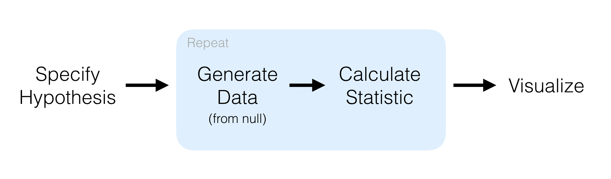

```{r, echo = FALSE}
knitr::opts_chunk$set(warning = FALSE, message = FALSE, out.width = "100%")
```

# {.tabset}
        
## Index



### Load 

```{r}
library(tidyverse)
library(tidymodels)
library(patchwork)
library(magrittr)
library(nycflights13)
```

### Examples

```{r}
# convert ordinal to factors
mtcars %<>% as.data.frame() %>%
    mutate(
        cyl = factor(cyl),
        vs = factor(vs),
        am = factor(am),
        gear = factor(gear),
        carb = factor(carb)
    )
```

Now we can perform a hypothesis test for a difference in proportions (using the formula interface `y ~ x` in `specify()`)

```{r}
mtcars %>%
    specify(am ~ vs, success = "1") %>%
    hypothesize(null = "independence") %>%
    generate(reps = 100, type = "permute") %>%
    calculate(stat = "diff in props", order = c("1", "0")) %>%
    head()
```

Confidence interval for a difference in means (using the non-formula interface giving both the response and explanatory variables in specify())

```{r}
mtcars %>%
    specify(response = mpg, explanatory = am) %>%
    generate(reps = 100, type = "bootstrap") %>%
    calculate(stat = "diff in means", order = c("1", "0")) %>%
    head()
```

Note that the formula and non-formula interfaces work for all implemented inference procedures in `infer`. Use whatever is more natural. If we will be doing modeling with functions like `lm()` and `glm()`, we should use the `y ~ x` notation. 

## Chi Sq

```{r}
library(nycflights13)

set.seed(8888)

flights %>%
    na.omit() %>%
    sample_n(size = 500) %>%
    mutate(season = case_when(
               month %in% c(10:12, 1:3) ~ "winter",
               month %in% c(4:9) ~ "summer"
           ),
           day_hour = case_when(
               between(hour, 1, 12) ~ "morning",
               between(hour, 13, 24) ~ "not morning"
           )) %>%
    select(arr_delay, dep_delay, season, day_hour, origin, carrier) -> fli_small

fli_small %>% head()
```

Now we have: 

- two numeric : arr_delay and dep_delay 

- two categories : season and day_hour 

- three categories for origin (EWR, JFK, LGA)

- sixteen categories for carrier

### One Numeric, One Categorical (2 Levels)

#### Calculate Observed Statistic

```{r}
obs_chisq <- fli_small %>%
    specify(origin ~ season) %>%
    calculate(stat = "Chisq")

# alternatively
fli_small %>%
    chisq_test(formula = origin ~ season) %>%
    select(statistic)

# alternatively
fli_small %>%
    chisq_stat(formula = origin ~ season)
```

Our chi sq statistic is 1.05. 

#### Randomization Approach to ChiSq Statistic

```{r}
fli_small %>%
    specify(origin ~ season) %>%
    hypothesize(null = "independence") %>%
    generate(reps = 1000, type = "permute") %>%
    calculate(stat = "Chisq") -> chisq_null_perm

visualize(chisq_null_perm) +
    shade_p_value(obs_chisq, direction = "greater")
```

#### Calculate the Randomization-Based p-value

```{r}
chisq_null_perm %>%
    get_p_value(obs_chisq, direction = "greater")
```

#### Theoretical Distribution

```{r}
fli_small %>%
    specify(origin ~ season) %>%
    hypothesize(null = "independence") %>%
    # generate not used for theoretical
    calculate(stat = "Chisq") -> chisq_null_theory

visualize(chisq_null_theory, method = "theoretical") +
    shade_p_value(obs_stat = obs_chisq, direction = "right")
```

#### Overlay Appropriate Chisq distribution on Top of Permuted Statistics

```{r}
visualize(chisq_null_perm, method = "both") +
    shade_p_value(obs_stat = obs_chisq, direction = "right")
```

#### Compute Theoretical P-value 

```{r}
fli_small %>%
    chisq_test(formula = origin ~ season) %>%
    pull(p_value)
```

## t test

#### Data Prep

```{r}
set.seed(8888)

fli_small <- flights %>%
    sample_n(size = 500) %>%
    mutate(half_year = case_when(
               between(month, 1, 6) ~ "h1",
               between(month, 7, 12) ~ "h2"
           ),
           day_hour = case_when(
               between(hour, 1, 12) ~ "morning",
               between(hour, 13, 24) ~ "not morning"
           )) %>%
    select(arr_delay, dep_delay, half_year, day_hour, origin, carrier)
```

#### One Numerical, One Categorical

##### Calculate Observed Statistic

```{r}
obs_t <- fli_small %>%
    specify(arr_delay ~ half_year) %>%
    calculate(stat = "t", order = c("h1", "h2"))

# alternatively
obs_t <- fli_small %>%
    t_test(formula = arr_delay ~ half_year, alternative = "two_sided",
           order = c("h1", "h2")) %>%
    pull(statistic)

# or
obs_t <- fli_small %>%
    t_stat(formula = arr_delay ~ half_year, order = c("h1", "h2"))
```

The observed t-statistic is `r obs_t`. 

#### Randomization Approach to t-statistic

```{r}
t_null_perm <- fli_small %>%
    specify(arr_delay ~ half_year) %>%
    hypothesize(null = "independence") %>%
    generate(reps = 1000, type = "permute") %>%
    calculate(stat = "t", order = c("h1", "h2"))

visualize(t_null_perm) +
    shade_p_value(obs_stat = obs_t, direction = "two_sided")
```

#### Calculate the Randomization based p-value 

```{r}
t_null_perm %>%
    get_p_value(obs_t, "two_sided")
```

#### Theoretical Distribution

```{r}
t_null_theory <- fli_small %>%
    specify(arr_delay ~ half_year) %>%
    hypothesize(null = "independence") %>%
    calculate(stat = "t", order = c("h1", "h2"))

visualize(t_null_theory, method = "theoretical") +
    shade_p_value(obs_t, "two_sided")
```

#### Observe Both

```{r}
visualize(t_null_perm, method = "both") +
    shade_p_value(obs_t, direction = "two_sided")
```

#### Compute Theoretical p-value

```{r}
fli_small %>%
    t_test(arr_delay ~ half_year,
           alternative = "two_sided",
           order = c("h1", "h2")) %>%
    pull(p_value)
```

## Pipelines

#### Data Prep

```{r}
library(nycflights13)

fli_small <- flights %>% 
  na.omit() %>%
    sample_n(size = 500) %>%
    mutate(
        season = case_when(
            month %in% c(10:12, 1:3) ~ "winter",
            month %in% c(4:9) ~ "summer"
        ),
        day_hour = case_when(
            between(hour, 1, 12) ~ "morning",
            between(hour, 13, 24) ~ "not morning"
        )) %>%
    select(arr_delay, dep_delay, season, day_hour, origin, carrier)
```

####  Hypothesis Tests

##### One Numerical Variable (Mean)

Observed Stat

```{r}
x_bar <- fli_small %>%
    specify(response = dep_delay) %>%
    calculate(stat = "mean")

null_dist <- fli_small %>%
    specify(response = dep_delay) %>%
    hypothesize(null = "point", mu = 10) %>%
    generate(reps = 1000) %>%
    calculate(stat = "mean")

visualize(null_dist) +
    shade_p_value(x_bar, "two_sided")

null_dist %>%
    get_p_value(x_bar, "two_sided")
```

##### One Numerical Value (Standardized Mean t)

Observed Stat

```{r}
t_bar <- fli_small %>%
    specify(response = dep_delay) %>%
    calculate(stat = "t")

null_dist <- fli_small %>%
    specify(response = dep_delay) %>%
    hypothesize(null = "point", mu = 8) %>%
    generate(reps = 1000) %>%
    calculate(stat = "t")

visualize(null_dist) +
    shade_p_value(t_bar, "two_sided")

null_dist %>%
    get_p_value(t_bar, "two_sided")
```

#### One Numerical Variable (median)

Observed Stat

```{r}
(x_tilde <- fli_small %>%
    specify(response = dep_delay) %>%
    calculate(stat = "median"))

null_dist <- fli_small %>%
    specify(response = dep_delay) %>%
    hypothesize(null = "point", med = -1) %>%
    generate(reps = 1000) %>%
    calculate(stat = "median")

visualize(null_dist) +
    shade_p_value(x_tilde, "two_sided")

null_dist %>%
    get_p_value(x_tilde, "two_sided")
```

#### One Categorical (One Proportion)

Observed Stat

```{r}
(p_hat <- fli_small %>%
    specify(response = day_hour, success = "morning") %>%
    calculate(stat = "prop"))

null_dist <- fli_small %>%
    specify(response = day_hour, success = "morning") %>%
    hypothesize(null = "point", p = 0.5) %>%
    generate(reps = 1000) %>%
    calculate(stat = "prop")

visualize(null_dist) +
    shade_p_value(p_hat, "two_sided")

null_dist %>%
    get_p_value(p_hat, "two_sided")
```

Logical variables will be coerced to factors: 

```{r}
null_dist <- fli_small %>%
    mutate(day_hour_logical = (day_hour == "morning")) %>%
    specify(response = day_hour_logical, success = "TRUE") %>%
    hypothesize(null = "point", p = 0.5) %>%
    generate(reps = 1000) %>%
    calculate(stat = "prop")
```

#### Two Categorical (2 level) Variables

Observed Stat

```{r}
(d_hat <- fli_small %>%
     specify(day_hour ~ season, success = "morning") %>%
     calculate(stat = "diff in props", order = c("winter", "summer"))) 

null_dist <- fli_small %>%
    specify(day_hour ~ season, success = "morning") %>%
    hypothesize(null = "independence") %>%
    generate(reps = 1000) %>%
    calculate(stat = "diff in props", order = c("winter", "summer"))

visualize(null_dist) +
    shade_p_value(d_hat, "two_sided")

null_dist %>%
    get_p_value(d_hat, "two_sided")
```

#### Two Categorical (2 level) Variables (z)

```{r}
(z_hat <- fli_small %>%
    specify(day_hour ~ season, success = "morning") %>%
    calculate(stat = "z", order = c("winter", "summer")))

null_dist <- fli_small %>%
    specify(day_hour ~ season, success = "morning") %>%
    hypothesize(null = "independence") %>%
    generate(reps = 1000) %>%
    calculate(stat = "z", order = c("winter", "summer"))

visualize(null_dist) +
    shade_p_value(obs_stat = z_hat, direction = "two_sided")

null_dist %>%
    get_p_value(obs_stat = z_hat, direction = "two_sided")
```

#### One Categorical (> 2 level) - GoF

Observed Stat

Note the need to add in the hypothesized values here to compute the observed statistic. 

```{r}
(Chisq_hat <- fli_small %>%
    specify(response = origin) %>%
    hypothesize(null = "point", p = c("EWR" = 0.33, "JFK" = 0.33, "LGA" = 0.34)) %>%
    calculate(stat = "Chisq"))

null_dist <- fli_small %>%
    specify(response = origin) %>%
    hypothesize(null = "point", p = c("EWR" = 0.33, "JFK" = 0.33, "LGA" = 0.34)) %>%
    generate(reps = 1000, type = "simulate") %>%
    calculate(stat = "Chisq")

visualize(null_dist) +
    shade_p_value(obs_stat = Chisq_hat, direction = "greater")

null_dist %>%
    get_p_value(obs_stat = Chisq_hat, direction = "greater")
```

#### Two Categorical (> 2 level) Variables 

Observed Stat

```{r}
(Chisq_hat <- fli_small %>%
    specify(formula = day_hour ~ origin) %>%
    calculate(stat = "Chisq"))

null_dist <- fli_small %>%
    specify(day_hour ~ origin) %>%
    hypothesize(null = "independence") %>%
    generate(reps = 1000, type = "permute") %>%
    calculate(stat = "Chisq")

visualize(null_dist) +
    shade_p_value(obs_stat = Chisq_hat, direction = "greater")

null_dist %>%
    get_p_value(obs_stat = Chisq_hat, direction = "greater")
```

#### One Numerical Variable, One Categorical (2 levels) :: Diff in Means

Observed Stat

```{r}
(d_hat <- fli_small %>%
    specify(dep_delay ~ season) %>%
    calculate(stat = "diff in means", order = c("summer", "winter")))
```

```{r}
null_dist <- fli_small %>%
    specify(dep_delay ~ season) %>%
    hypothesize(null = "independence") %>%
    generate(reps = 1000, type = "permute") %>%
    calculate(stat = "diff in means", order = c("summer", "winter"))

visualize(null_dist) +
    shade_p_value(obs_stat = d_hat, direction = "two_sided")

null_dist %>%
    get_p_value(obs_stat = d_hat, direction = "two_sided")
```

#### One Numerical Variable, One Categorical (2 levels) (t)

```{r}
# observed stat
(t_hat <- fli_small %>%
    specify(dep_delay ~ season) %>%
    calculate(stat = "t", order = c("summer", "winter")))
```

```{r}
null_dist <- fli_small %>%
    specify(dep_delay ~ season) %>%
    hypothesize(null = "independence") %>%
    generate(reps = 1000, type = "permute") %>%
    calculate(stat = "t", order = c("summer", "winter"))

visualize(null_dist) +
    shade_p_value(obs_stat = t_hat, direction = "two_sided")

null_dist %>%
    get_p_value(obs_stat = t_hat, direction = "two_sided")
```

#### One Numerical Value, One Categorical (2 levels) (diff in medians)

```{r}
# observed variable
(d_hat <- fli_small %>%
     specify(dep_delay ~ season) %>%
     calculate(stat = "diff in medians", order = c("summer", "winter")))

null_dist <- fli_small %>%
    specify(dep_delay ~ season) %>%
    hypothesize(null = "independence") %>%
    generate(reps = 1000, type = "permute") %>%
    calculate(stat = "diff in medians", order = c("summer", "winter"))

visualize(null_dist) +
    shade_p_value(d_hat, "two_sided")

null_dist %>%
    get_p_value(d_hat, "two_sided")

```

#### One Numerical, One Categorical (> 2 Levels) ANOVA

```{r}
(f_hat <- fli_small %>%
     specify(arr_delay ~ origin) %>%
     calculate(stat = "F"))

null_dist <- fli_small %>%
    specify(arr_delay ~ origin) %>%
    hypothesize(null = "independence") %>%
    generate(reps = 1000, type = "permute") %>%
    calculate(stat = "F")

visualize(null_dist) +
    shade_p_value(f_hat, "greater")

null_dist %>%
    get_p_value(f_hat, "greater")
```

#### Two Numerical Variables - SLR 

```{r}
(slope_hat <- fli_small %>%
     specify(arr_delay ~ dep_delay) %>%
     calculate(stat = "slope"))

null_dist  <- fli_small %>%
    specify(arr_delay ~ dep_delay) %>%
    hypothesize(null = "independence") %>%
    generate(reps = 1000, type = "permute") %>%
    calculate(stat = "slope")

visualize(null_dist) +
    shade_p_value(slope_hat, "two_sided")

null_dist %>%
    get_p_value(slope_hat, "two_sided")
```

#### Two Numerical Values (correlation)

```{r}
# observed stat
(correlation_hat <- fli_small %>%
     specify(arr_delay ~ dep_delay) %>%
     calculate(stat = "correlation"))

null_dist <- fli_small %>%
    specify(arr_delay ~ dep_delay) %>%
    hypothesize(null = "independence") %>%
    generate(reps = 1000, type = "permute") %>%
    calculate(stat = "correlation")

visualize(null_dist) +
    shade_p_value(correlation_hat, "two_sided")
```
### Confidence Intervals 

#### One Numerical (One Mean)

```{r}
# point estimate
(x_bar <- fli_small %>%
     specify(response = arr_delay) %>%
     calculate("mean"))

boot <- fli_small %>%
    specify(response = arr_delay) %>%
    generate(reps = 1000, type = "bootstrap") %>%
    calculate(stat = "mean")

(percentile_ci <- get_ci(boot))

visualize(boot) +
    shade_confidence_interval(endpoints = percentile_ci)

(standard_error_ci <- get_ci(boot, type = "se", point_estimate = x_bar))

visualize(boot) +
    shade_confidence_interval(endpoints = standard_error_ci)
```

#### One Numerical (One Mean - Standardized)

```{r}
# point estimate
(t_hat <- fli_small %>%
     specify(response = arr_delay) %>%
     calculate(stat = "t")) 

boot <- fli_small %>%
    specify(response = arr_delay) %>%
    generate(reps = 1000, type = "bootstrap") %>%
    calculate(stat = "t")

(percentile_ci <- get_ci(boot))

visualize(boot) +
    shade_confidence_interval(percentile_ci)

(standard_error_ci <- get_ci(boot, type = "se", point_estimate = t_hat))

visualize(boot) +
    shade_confidence_interval(endpoints = standard_error_ci)

```

#### One Categorical (One Proportion)

```{r}
(p_hat <- fli_small %>%
     specify(response = day_hour, success = "morning") %>%
     calculate(stat = "prop"))

boot <- fli_small %>%
    specify(response = day_hour, success = "morning") %>%
    generate(reps = 1000, type = "bootstrap") %>%
    calculate(stat = "prop")

(percentile_ci <- get_ci(boot))

visualize(boot) +
    shade_confidence_interval(endpoints = percentile_ci)

(standard_error_ci <- get_ci(boot, type = "se", point_estimate = p_hat))

visualize(boot) +
    shade_confidence_interval(endpoints = standard_error_ci)
```

#### One Numerical, One Categorical (2 levels)(Diff in Means)

```{r}
# point estimate
(d_hat <- fli_small %>%
     specify(arr_delay ~ season) %>%
     calculate(stat = "diff in means", order = c("summer", "winter")))

boot <- fli_small %>%
    specify(arr_delay ~ season) %>%
    generate(reps = 1000, type = "bootstrap") %>%
    calculate(stat = "diff in means", order = c("summer", "winter"))

(percentile_ci <- get_ci(boot))

visualize(boot) +
    shade_confidence_interval(endpoints = percentile_ci)

(standard_error_ci <- get_ci(boot, type = "se", point_estimate = d_hat))

visualize(boot) +
    shade_confidence_interval(endpoints = standard_error_ci)
```

#### One Numerical Variable, One Categorical (2 levels) (t)

```{r}
# standardized point estimate
(t_hat <- fli_small %>%
     specify(arr_delay ~ season) %>%
     calculate(stat = "t", order = c("summer", "winter")))

boot <- fli_small %>%
    specify(arr_delay ~ season) %>%
    generate(reps = 1000, type = "bootstrap") %>%
    calculate(stat = "t", order = c("summer", "winter"))

(percentile_ci <- get_ci(boot))

visualize(boot) +
    shade_confidence_interval(percentile_ci)

(standard_error_ci <- get_ci(boot, type = "se", point_estimate = t_hat))

visualize(boot) +
    shade_confidence_interval(endpoints = standard_error_ci)
```

#### Two Categorical Variables (Diff in Proportions)

```{r}
(d_hat <- fli_small %>%
     specify(day_hour ~ season, success = "morning") %>%
     calculate(stat = "diff in props", order = c("summer", "winter")))

boot <- fli_small %>%
    specify(day_hour ~ season, success = "morning") %>%
    generate(reps = 1000, type = "bootstrap") %>%
    calculate(stat = "diff in props", order = c("summer", "winter"))

(percentile_ci <- get_ci(boot))

visualize(boot) +
    shade_confidence_interval(endpoints = percentile_ci)

(standard_error_ci <- get_ci(boot, type = "se", point_estimate = d_hat))

visualize(boot) +
    shade_confidence_interval(endpoints = standard_error_ci)
```

#### Two Categorical Variables (z)

```{r}
# standardized point estimate
(z_hat <- fli_small %>%
     specify(day_hour ~ season, success = "morning") %>%
     calculate(stat = "z", order = c("summer", "winter")))

boot <- fli_small %>%
    specify(day_hour ~ season, success = "morning") %>%
    generate(reps = 1000, type = "bootstrap") %>%
    calculate(stat = "z", order = c("summer", "winter"))

(percentile_ci <- get_ci(boot))

visualize(boot) +
    shade_confidence_interval(endpoints = percentile_ci)

(standard_error_ci <- get_ci(boot, type = "se", point_estimate = z_hat))

visualize(boot) +
    shade_confidence_interval(standard_error_ci)

```

#### Two Numeric Variables (SLR)

```{r}
# point estimate
(slope_hat <- fli_small %>%
     specify(arr_delay ~ dep_delay) %>%
     calculate(stat = "slope"))

boot <- fli_small %>%
    specify(arr_delay ~ dep_delay) %>%
    generate(reps = 1000, type = "bootstrap") %>%
    calculate(stat = "slope")

(percentile_ci <- get_ci(boot))

visualize(boot) +
    shade_confidence_interval(percentile_ci)

(standard_error_ci <- get_ci(boot, type = "se", point_estimate = slope_hat))

visualize(boot) +
    shade_confidence_interval(standard_error_ci)

```

#### Two Numeric Variables Correlation

```{r}
# point estimate
(correlation_hat <- fli_small %>%
     specify(arr_delay ~ dep_delay) %>%
     calculate(stat = "correlation"))

boot <- fli_small %>%
    specify(arr_delay ~ dep_delay) %>%
    generate(reps = 1000, type = "bootstrap") %>%
    calculate(stat = "correlation")

(percentile_ci <- get_ci(boot))

visualize(boot) +
    shade_confidence_interval(endpoints = percentile_ci)

(standard_error_ci <- get_ci(boot, type = "se", point_estimate = correlation_hat))

visualize(boot) +
    shade_confidence_interval(endpoints = standard_error_ci)
```

## Randomization

### Data Prep

```{r}
fli_small <- flights %>%
    na.omit() %>%
    sample_n(size = 500) %>%
    mutate(
        season = case_when(
            month %in% c(10:12, 1:3) ~ "winter",
            month %in% c(4:9) ~ "summer"
        ),
        day_hour = case_when(
            between(hour, 1, 12) ~ "morning",
            between(hour, 13, 24) ~ "not morning"
        )) %>%
    select(arr_delay, dep_delay, season, day_hour, origin, carrier)    
```

### Hypothesis Tests

#### One Numerical Variable (mean)

```{r}
x_bar <- fli_small %>%
    summarize(mean(dep_delay)) %>%
    pull()

null_dist <- fli_small %>%
    specify(response = dep_delay) %>%
    hypothesize(null = "point", mu = 10) %>%
    generate(reps = 1000, type = "bootstrap") %>%
    calculate(stat = "mean")

null_dist %>%
    ggplot(aes(x = stat)) +
    geom_density() +
    geom_vline(xintercept = x_bar, color = "red")

null_dist %>%
    summarize(p_value = mean(stat >= x_bar) * 2)

```

#### One Numerical Variable (median)

```{r}
x_tilde <- fli_small %>%
    summarize(median(dep_delay)) %>%
    pull()

null_dist <- fli_small %>%
    specify(response = dep_delay) %>%
    hypothesize(null = "point", med = -1) %>%
    generate(reps = 1000, type = "bootstrap") %>%
    calculate(stat = "median")

null_dist %>%
    ggplot(aes(x = stat)) +
    geom_bar() +
    geom_vline(xintercept = x_tilde, color = "red")

null_dist %>%
    summarize(p_value = mean(stat <= x_tilde) * 2)

```

#### One Categorical (One Proportion)

```{r}
p_hat <- fli_small %>%
    summarize(mean(day_hour == "morning")) %>%
    pull()

null_dist <- fli_small %>%
    specify(response = day_hour, success = "morning") %>%
    hypothesize(null = "point", p = 0.5) %>%
    generate(reps = 1000, type = "simulate") %>%
    calculate(stat = "prop")

null_dist %>%
    ggplot(aes(x = stat)) +
    geom_bar() +
    geom_vline(xintercept = p_hat, color = "red")

null_dist %>%
    summarize(p_value = mean(stat <= p_hat) * 2)
```

Logical variables will be coerced to factors.

#### Two Categorical (2 level) Variables 

```{r}
d_hat <- fli_small %>%
    group_by(season) %>%
    summarize(prop = mean(day_hour == "morning")) %>%
    summarize(diff(prop)) %>%
    pull()

null_dist <- fli_small %>%
    specify(day_hour ~ season, success = "morning") %>%
    hypothesize(null = "independence") %>%
    generate(reps = 1000, type = "permute") %>%
    calculate(stat = "diff in props", order = c("winter", "summer"))

null_dist %>%
    ggplot(aes(x = stat)) +
    geom_density() +
    geom_vline(xintercept = d_hat, color = "red")

null_dist %>%
    summarize(p_value = mean(stat <= d_hat) * 2) %>%
    pull()

```

#### One Categorical (> 2 Level) GoF

```{r}
Chisq_hat <- fli_small %>%
    specify(response = origin) %>%
    hypothesize(null = "point",
                p = c("EWR" = 0.33, "JFK" = 0.33, "LGA" = 0.34)) %>%
    calculate(stat = "Chisq")

null_dist <- fli_small %>%
    specify(response = origin) %>%
    hypothesize(null = "point",
                p = c("EWR" = 0.33, "JFK" = 0.33, "LGA" = 0.34)) %>%
    generate(reps = 1000, type = "simulate") %>%
    calculate(stat = "Chisq")

null_dist %>%
    ggplot(aes(x = stat)) +
    geom_density() +
    geom_vline(xintercept = pull(Chisq_hat), color = "red")

null_dist %>%
    summarize(p_value = mean(stat >= pull(Chisq_hat))) %>%
    pull()

```

#### Two Categorical (> 2 level) variables 

```{r}
Chisq_hat <- fli_small %>%
    chisq_stat(formula = day_hour ~ origin)

null_dist <- fli_small %>%
    specify(day_hour ~ origin, success = "morning") %>%
    hypothesize(null = "independence") %>%
    generate(reps = 1000, type = "permute") %>%
    calculate(stat = "Chisq")

null_dist %>%
    ggplot(aes(x = stat)) +
    geom_density() +
    geom_vline(xintercept = pull(Chisq_hat), color = "red")

null_dist %>%
    summarize(p_value = mean(stat >= pull(Chisq_hat))) %>%
    pull()
```

#### One Numerical, One Categorical (2 levels) (diff in means)

```{r}
d_hat <- fli_small %>%
    group_by(season) %>%
    summarize(mean_stat = mean(dep_delay)) %>%
    pull()

null_dist <- fli_small %>%
    # explanatory = season, response = delay 
    specify(dep_delay ~ season) %>%
    hypothesize(null = "independence") %>%
    generate(reps = 1000, type = "permute") %>%
    calculate(stat = "diff in means", order = c("summer", "winter"))

null_dist %>%
    ggplot(aes(x = stat)) +
    geom_density() +
    geom_vline(xintercept = d_hat, color = "red")

null_dist %>%
    summarize(p_value = mean(stat <= d_hat) * 2) %>%
    pull()
```

#### One Numerical, One Categorical (2 levels) (diff in medians)

```{r}
d_hat <- fli_small %>%
    group_by(season) %>%
    summarize(median_stat = median(dep_delay)) %>%
    summarize(- diff(median_stat)) %>%  # since summer - winter
    pull()

null_dist <- fli_small %>%
    specify(dep_delay ~ season) %>%
    hypothesize(null = "independence") %>%
    generate(reps = 1000, type = "permute") %>%
    calculate(stat = "diff in medians", order = c("summer", "winter"))

null_dist %>%
    ggplot(aes(x = stat)) +
    geom_bar() +
    geom_vline(xintercept = d_hat, color = "red")

null_dist %>%
    summarize(p_value = mean(stat >= d_hat) * 2) %>%
    pull()
```

#### One Numerical, One Categorical (> 2 levels) - ANOVA

```{r}
F_hat <- anova(aov(formula = arr_delay ~ origin, data = fli_small))$`F value`[1]

null_dist <- fli_small %>%
    specify(arr_delay ~ origin) %>%
    hypothesize(null = "independence") %>%
    generate(reps = 1000, type = "permute") %>%
    calculate(stat = "F")

null_dist %>%
    ggplot(aes(x = stat)) +
    geom_density() +
    geom_vline(xintercept = F_hat, color = "red")

null_dist %>%
    summarize(p_value = mean(stat >= F_hat)) %>%
    pull()
```

#### Two Numerical Values - SLR 

```{r}
slope_hat <- lm(arr_delay ~ dep_delay, data = fli_small) %>%
    broom::tidy() %>%
    filter(term == "dep_delay") %>%
    pull(estimate)

null_dist <- fli_small %>%
    specify(arr_delay ~ dep_delay) %>%
    hypothesize(null = "independence") %>%
    generate(reps = 1000, type = "permute") %>%
    calculate(stat = "slope")

null_dist %>%
    ggplot(aes(x = stat)) +
    geom_density() +
    geom_vline(xintercept = slope_hat, color = "red")

null_dist %>%
    summarize(p_value = mean(stat >= slope_hat) * 2) %>%
    pull()
```

### Confidence Intervals

#### One Numerical (one mean)

```{r}
x_bar <- fli_small %>%
    summarize(mean(arr_delay)) %>%
    pull()

boot <- fli_small %>%
    specify(response = arr_delay) %>%
    generate(reps = 1000, type = "bootstrap") %>%
    calculate(stat = "mean") %>%
    pull()

c(lower = x_bar- 2 * sd(boot),
  upper = x_bar + 2 * sd(boot))
```

#### One Categorical (One Proportion)

```{r}
p_hat <- fli_small %>%
    summarize(mean(day_hour == "morning")) %>%
    pull()

boot <- fli_small %>%
    specify(response = day_hour, success = "morning") %>%
    generate(reps = 1000, type = "bootstrap") %>%
    calculate(stat = "prop") %>%
    pull()

c(lower = p_hat - 2 * sd(boot),
  upper = p_hat + 2 * sd(boot))
```

#### One Numerical, One Categorical (2 levels) (diff in means)

```{r}
d_hat <- fli_small %>%
    group_by(season) %>%
    summarize(mean_stat = mean(arr_delay)) %>%
    summarize(-diff(mean_stat)) %>%
    pull()

boot <- fli_small %>%
    specify(arr_delay ~ season) %>%
    generate(reps = 1000, type = "bootstrap") %>%
    calculate(stat = "diff in means", order = c("summer", "winter")) %>%
    pull()

c(lower = d_hat - 2 * sd(boot),
  upper = d_hat + 2 * sd(boot))
```

#### Two Categorical Variables (Diff in Proportions)

```{r}
d_hat <- fli_small %>%
    group_by(season) %>%
    summarize(prop = mean(day_hour == "morning")) %>%
    pull()

boot <- fli_small %>%
    specify(day_hour ~ season, success = "morning") %>%
    generate(reps = 1000, type = "bootstrap") %>%
    calculate(stat = "diff in props", order = c("summer", "winter")) %>%
    pull()

c(lower = d_hat - 2 * sd(boot),
  upper = d_hat + 2 * sd(boot))
```

#### Two Numerical Variables - SLR 

```{r}
slope_hat <- lm(arr_delay ~ dep_delay, data = fli_small) %>%
    broom::tidy() %>%
    filter(term == "dep_delay") %>%
    pull(estimate)

boot <- fli_small %>%
    specify(arr_delay ~ dep_delay) %>%
    generate(reps = 1000, type = "bootstrap") %>%
    calculate(stat = "slope") %>%
    pull()

c(lower = slope_hat - 2 * sd(boot),
  upper = slope_hat + 2 * sd(boot))
```

## mtcars

### Data Preparation

```{r}
mtcars %<>%
    mutate_if(is.integer, .funs = as.factor)

# for reproducibility
set.seed(2018)

# make plot
make_graph <- function(data, stat_intercept) {
    data %>%
        ggplot(aes(x = stat)) +
        geom_density() +
        geom_vline(xintercept = stat_intercept, color = "blue")
}
```

#### One Numerical (mean)

```{r}
mtcars %>%
    specify(response = mpg) %>%
    hypothesize(null = "point", mu = 25) %>%
    generate(reps = 100, type = "bootstrap") %>%
    calculate(stat = "mean") %>%
    make_graph(25)
```

#### One Numerical (median)

```{r}
mtcars %>%
    specify(response = mpg) %>%
    hypothesize(null = "point", med = 26) %>%
    generate(reps = 1000, type = "bootstrap") %>%
    calculate(stat = "median") %>%
    make_graph(26)
```

#### One Categorical (2 level) 

```{r}
mtcars %>%
    specify(response = am, success = "1") %>%
    hypothesize(null = "point", p = 0.25) %>%
    generate(reps = 1000, type = "simulate") %>%
    calculate(stat = "prop") %>%
    make_graph(0.25)
```

#### Two Categorical (2 level)

```{r}
mtcars %>%
    specify(am ~ vs, success = "1") %>%
    hypothesize(null = "independence") %>%
    generate(reps = 100, type = "permute") %>%
    calculate(stat = "diff in props", order = c("0", "1")) %>%
    make_graph(0)
```

#### One Categorical (> 2 level) Goodness of Fit

```{r}
mtcars %>%
    specify(cyl ~ NULL) %>%
    hypothesize(null = "point",
                p = c("4" = 0.5, "6" = 0.25, "8" = 0.25)) %>%
    generate(reps = 100, type = "simulate") %>%
    calculate(stat = "Chisq") %>%
    make_graph(0.5)
```

#### Two Categorical (> 2 level)

```{r}
mtcars %>%
    specify(cyl ~ am) %>%
    hypothesize(null = "independence") %>%
    generate(reps = 100, type = "permute") %>%
    calculate(stat = "Chisq") %>%
    make_graph(1)
```

#### One Numerical One Categorical (2 levels) (diff in means)

```{r}
mtcars %>%
    specify(mpg ~ am) %>%
    hypothesize(null = "independence") %>%
    generate(reps = 100, type = "permute") %>%
    calculate(stat = "diff in means", order = c("0", "1")) %>%
    make_graph(0)
```

#### One Numerical One Categorical (diff in medians)

```{r}
mtcars %>%
    specify(mpg ~ am) %>%
    hypothesize(null = "independence") %>%
    generate(reps = 100, type = "permute") %>%
    calculate(stat = "diff in medians", order = c("0", "1")) %>%
    make_graph(0)
```

#### One Numerical, One Categorical (>2 levels) ANOVA

```{r}
mtcars %>%
    specify(mpg ~ cyl) %>%
    hypothesize(null = "independence") %>%
    generate(reps = 100, type = "permute") %>%
    calculate(stat = "F") %>%
    make_graph(0)
```

#### Two Numerical, SLR

```{r}
mtcars %>%
    specify(mpg ~ hp) %>%
    hypothesize(null = "independence") %>%
    generate(reps = 100, type = "permute") %>%
    calculate(stat = "slope") %>%
    make_graph(0)
```

#### One Numerical (Standard Deviation)

```{r}
mtcars %>%
    specify(response = mpg) %>%
    hypothesize(null = "point", sigma = 5) %>%
    generate(reps = 100, type = "bootstrap") %>%
    calculate(stat = "sd") %>%
    make_graph(5) 
``` 

### Confidence Intervals 

```{r}
# make confint graph
confint <- function(data) {
    
    stddev <- sd(data$stat)
    getmean <- mean(data$stat)
    
    data %>%
        ggplot(aes(x = stat)) +
        geom_density() +
        geom_vline(xintercept = (getmean - 2 * stddev), color = "blue") +
        geom_vline(xintercept = (getmean + 2 * stddev), color = "blue")
}
```

#### One Numerical (mean)

```{r}
mtcars %>%
    specify(response = mpg) %>%
    generate(reps = 100, type = "bootstrap") %>%
    calculate(stat = "mean") %>%
    confint()
```

#### One Numeric (median)

```{r}
mtcars %>%
    specify(response = mpg) %>%
    generate(reps = 100, type = "bootstrap") %>%
    calculate(stat = "median") %>%
    confint()
```

#### One Numeric (Standard Deviation)

```{r}
mtcars %>%
    specify(response = mpg) %>%
    generate(reps = 100, type = "bootstrap") %>%
    calculate(stat = "sd") %>%
    confint()
```

#### One Categorical (proportion)

```{r}
mtcars %>%
    specify(response = am, success = "1") %>%
    generate(reps = 100, type = "bootstrap") %>%
    calculate(stat = "prop") %>%
    confint()
```

#### One Numeric, One Categorical (2 levels) (diff in means)

```{r}
mtcars %>%
    specify(mpg ~ am) %>%
    generate(reps = 100, type = "bootstrap") %>%
    calculate(stat = "diff in means", order = c("0", "1")) %>%
    confint()
```

#### Two Categorical (diff in proportions)

```{r}
mtcars %>%
    specify(am ~ vs, success = "1") %>%
    generate(reps = 100, type = "bootstrap") %>%
    calculate(stat = "diff in props", order = c("0", "1")) %>%
    confint()
```

#### Two Numerical SLR

```{r}
mtcars %>%
    specify(mpg ~ hp) %>%
    generate(reps = 100, type = "bootstrap") %>%
    calculate(stat = "slope") %>%
    confint()
```

#### Two Numerical Correlation

```{r}
mtcars %>%
    specify(mpg ~ hp) %>%
    generate(reps = 100, type = "bootstrap") %>%
    calculate(stat = "correlation") %>%
    confint()
```
