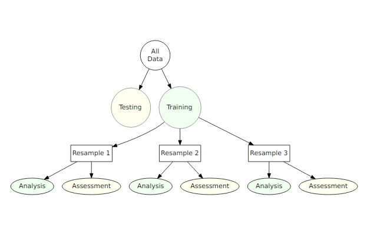

```{r, echo = FALSE}
knitr::opts_chunk$set(warning = FALSE, message = FALSE)
```

# {.tabset}
        
## Intro

`rsample` contains a set of functions that can create different types of resamples and corresponding classes for their analysis. The goal is to have a modular set of methods for 

- traditional resampling techniques for estimating the sampling distribution of a statistic
- estimating model performance using a holdout set

This is a notebook implementing the vignettes available at [tidymodels :: rsample](https://tidymodels.github.io/rsample/index.html)

## Load

```{r}
library(tidyverse)
library(tidymodels)
library(magrittr)
```

## Basics

### Terminology

We define a resample as the result of a two way split of a data set. For example, when bootstrapping, one part of the resample is a sample with replacement of the original data and the other part contains the instances that were not contained in the bootstrap sample. Cross-validation is another type of resampling. 

### `rset` Objects Contain Many Resamples 

The main class in the package (rset) is a set or collection of resamples. In 10 fold cross validation, the set would consist of the 10 different resamples of the original data. 

Here is a small set of bootstraps of the mtcars data

```{r}
# set seed for reproducibility
set.seed(8888)

(bt_resamples <- bootstraps(mtcars, times = 3))
```

### Individual Resamples are `rsplit` Objects

In this package, the following terminology is used for the two partitions that comprise a sample: 

- The _analysis_ data is that data that we selected in the resample. For a bootstrap, this is the sample with replacement. For 10 fold CV, this is the 90% of the data. This data is often used to fit a model or calculate a statistic in traditional bootstrapping. 

- The _assessment_ data is usually the section of the original data not covered by the analysis set. Again, in 10 fold CV, this is the 10% held out. This data is often used to evaluate the performance of a model that was fit to the analysis data. 

Let's take a look at one of the rsplit objects 

```{r}
(first_resample <- bt_resamples$splits[[1]])
```

This indicates that there were 32 data points in the analysis set, 14 instances in the assessment set, and that the original data contained 32 data points. To obtain either of these data sets from `rsplit`, the `as.data.frame` can be used. By default the analysis set is returned but the `data` option can be used to return the assessment data.

```{r}
as.data.frame(first_resample) %>% head()
```

alternatively, we can use the following 

```{r}
analysis(first_resample)

assessment(first_resample)
```

## rsets 

This page contains examples on how to use rset objects. For illustration, the `attrition` data is used. From the help file:

> These data are from the IBM Watson Analytics Lab. The website describes the data with “Uncover the factors that lead to employee attrition and explore important questions such as ‘show me a breakdown of distance from home by job role and attrition’ or ‘compare average monthly income by education and attrition’. This is a fictional data set created by IBM data scientists.” There are 1470 rows.

```{r}
# load data
data("attrition")

names(attrition)
```

### Model Assessment 

Let's fit a logistic regression model to the data with model terms for the job satisfaction, gender, and monthly income. 

If we were fitting the model to the entire dataset, we might model attrition using 

```{r}
glm(Attrition ~ JobSatisfaction + Gender + MonthlyIncome, data = attrition, family = binomial)
```

For convenience we will create a formula object that will be used later: 

```{r}
mod_form <- as.formula(Attrition ~ JobSatisfaction + Gender + MonthlyIncome)
```

To evaluate this model we will use 10 repeats of 10fold CV and use the 100 holdout samples to evaluate the overall accuracy of the model. 

```{r}
# make splits of the data
set.seed(8888)

rs_obj <- vfold_cv(attrition, v = 10, repeats = 10)

rs_obj %>% head()
```

Now let's write a function that will, for each resample: 

1. Obtain the analysis data set 
2. Fit a logistic regression model
3. Predict the assessment data using the broom package
4. Determine if each sample was predicted correctly 

```{r}
# splits will be the `rsplit` object with the 90/10 partition
holdout_results <- function(splits, ...) {
    # fit the model to the 90%
    mod <- glm(..., data = analysis(splits), family = binomial)

    # save the 10%
    holdout <- assessment(splits)

    # augment will save the predictions with the holdout data set
    res <- augment(mod, newdata = holdout)

    # class predictions on the assessment set from class probs
    lvls <- levels(holdout$Attrition)
    predictions <- factor(ifelse(res$.fitted > 0, lvls[2], lvls[1]), levels = lvls)

    # calculate whether the prediction was correct
    res$correct <- predictions == holdout$Attrition

    # return the assessment data set with the additional columns
    res
}
```

For example: 

```{r}
example <- holdout_results(rs_obj$splits[[1]], mod_form)

dim(example)

dim(assessment(rs_obj$splits[[1]]))

# example
example[1:10, setdiff(names(example), names(attrition))]
```

For this model, the `.fitted` value is the linear predictor in log-odds units. 

To compute this data set for each of the 100 resamples, we'll use the `map` function from the `purrr` package: 

```{r}
rs_obj$results <- map(rs_obj$splits, holdout_results, mod_form)

rs_obj %>% head()
```

Now we can compute the accuracy values for all of the assessment data sets: 

```{r}
rs_obj$accuracy <- map_dbl(rs_obj$results, function(x) mean(x$correct))

rs_obj$accuracy %>% summary() 
```

Keep in mind that the baseline accuracy to beat is the rate of non-attrition, which is 0.839. This is not a great model so far. 

### Using the Bootstrap to Make Comparisons

Traditionally the bootstrap has been primarily used to empirically determine the sampling distribution of a test statistic. Given a set of samples with replacement, a statistic can be calculated on each analysis set and the results can be used to make inferences (such as confidence intervals). 

For example, are there differences in the median monthly income between genders? 

```{r}
attrition %>%
    ggplot(aes(x = Gender, y = MonthlyIncome)) +
    geom_boxplot() +
    scale_y_log10()
```

If we wanted to compare the genders, we could conduct a t-test or rank-based test. Instead, lets use the bootstrap to see if there is a different in the median incomes for the two groups. We need a simple function to compute this statistic on the resample 

```{r}
median_diff <- function(splits) {
    x <- analysis(splits)

    median(x$MonthlyIncome[x$Gender == "Female"]) -
        median(x$MonthlyIncome[x$Gender == "Male"])
}
```

Now we would create a large number of bootstrap samples, say 2000+. 

```{r}
set.seed(8888)

bt_resamples <- bootstraps(attrition, times = 2000)
```

This function is then computed across each resample 

```{r}
bt_resamples$wage_diff <- map_dbl(bt_resamples$splits, median_diff)
```

The bootstrap of this statistic has a slightly bimodal and skewed distribution 

```{r}
bt_resamples %>%
    ggplot(aes(x = wage_diff)) +
    geom_line(stat = "density", adjust = 1.25) +
    xlab("Difference in Median Monthly Income (Female - Male)")
```

The variation is considerable in this statistic. One method of computing a confidence interval is to take the percentiles of the bootstrap distribution. A 95% confidence interval for the difference in the means would be

```{r}
quantile(bt_resamples$wage_diff, probs = c(0.025, 0.5, 0.975))
```

On average, there is no evidence for a difference in the genders. 

### Bootstrap Estimates of Model Coefficients

Unless there is already a column in the resample object that contains the fitted model, a function can be used to fit the model and save all of the model coefficients. the `broom` package has a tidy function that will save the coefficients in a dataframe. Instead of returning a dataframe with a row for each model term, we will save a data frame with a single row and columns for each model term. As before, map can be used to estimate and save these values for each split.

```{r}
glm_coefs <- function(splits, ...) {
    # use analysis or as.data.frame to get the analysis data
    mod <- glm(..., data = analysis(splits), family = binomial)
    as.data.frame(t(coef(mod)))
}

bt_resamples$betas <- map(.x = bt_resamples$splits,
                          .f = glm_coefs,
                          mod_form)

bt_resamples %>% head()

bt_resamples$betas[[1]]
```

### Keeping Tidy

As previously mentioned, `broom` contains a class called `tidy` that created representations of objects that can be easily used for analysis, plotting, etc. `rsample` contains tidy methods for rset and rsplit objects. 

For example 

```{r}
first_resample <- bt_resamples$splits[[1]]

first_resample %>% class()

first_resample %>% tidy() %>% head()

bt_resamples %>% class()

bt_resamples %>% tidy() %>% head()
```

## Recipes 

The `recipes` package contains a data preprocessor that can be used to avoid the potentially expensive formula methods as well as providing a richer set of data manipulation tools than base R can provide. This document uses version 0.1.4 of recipes. 

It is critical that any complex preprocessing steps be contained inside of resampling so that the model performance estimates take into account the variability of these steps. 

### An Example Recipe

For illustration, the Ames housing data will be used.

```{r}
library(AmesHousing)

ames <- make_ames()
names(ames)
```

Suppose that we wish to fit a simple regression model with the formula

```
log10(Sale_Price) ~ Neighborhood + House_Style + Year_Sold + Lot_Area
```

Let's take a look at the lot size: 

```{r}
ames %>%
    ggplot(aes(x = Lot_Area)) +
    geom_histogram(binwidth = 5000, col = "forestgreen", fill = "green", alpha = 0.5)
```

The distribution of the lot size is right skewed. It may benefit the model is we estimate a transformation of the data using the Box-Cox procedure. 

Also, note that the frequencies of the neighborhoods can vary: 

```{r}
ames %>%
    ggplot(aes(x = Neighborhood)) +
    geom_bar(color = "forestgreen", fill = "green", alpha = 0.5) +
    coord_flip() +
    xlab("")
```

When these are resampled, some neighborhoods will not be included in the test set and this will result in a column of dummy variables with zero entries. The same is true for the House_Style variable. We may want to collapse rarely occuring variables into "other" categories. 

To define the design matrix, an initial recipe is created:

```{r}
recipe(Sale_Price ~ Neighborhood + House_Style + Year_Sold + Lot_Area, data = ames) %>%
    # log the outcome
    step_log(Sale_Price, base = 10) %>%
    # collapse rarely occurring jobs into other
    step_other(Neighborhood, House_Style, threshold = 0.5) %>%
    # dummy variables on the qualitative predictors
    step_dummy(all_nominal()) %>%
    # unskew a predictor
    step_BoxCox(Lot_Area) %>%
    # normalize
    step_center(all_predictors()) %>%
    step_scale(all_predictors()) -> rec 

rec
```

This recreates the work that the formula method traditionally uses with the additional steps. While the original data object `ames` is used in the call, it is only used to define the variables and their characteristics so a single recipe is valid across all resampled versions of the data. The recipe can be estimated on the analysis component of the resample. 

If we execute the recipe on the entire data set: 

```{r}
(rec_training_set <- prep(rec, training = ames))
```

To get the values of the data, the `bake` function can be used

```{r}
bake(rec_training_set, new_data = head(ames))
```

Note that there are fewer dummy variables for `Neighborhood` and `House_Style` than in the data. 

Also, the above code using `prep` benefits from the default argument of `retain = TRUE`, which keeps the processed version of the data set so that we don't have to reapply the steps to extract the processed values. 

For the data used to train the recipe, we would have used:

```{r}
juice(rec_training_set) %>% head()
```

The next section will explore recipes and bootstrap resampling for modeling:

```{r}
set.seed(8888)
(bt_samples <- bootstraps(ames))

# look at one of the splits
bt_samples$splits[[1]]
```

The split above shows that our analysis set has 2930 samples, our assessment set have 1052 samples, and our overall data has 2930 samples.

### Working with Resamples

We can add our recipe in a column on a tibble. `recipes` has a convenient function called `prepper` that can be used to call `prep` but has the split objects as the first argument (for easier purrring). 

```{r}
bt_samples$recipes <- map(bt_samples$splits, prepper, recipe = rec)

bt_samples

bt_samples$recipes[[1]]
```

Now, to fit the model, the fit function only needs the recipe as input. This is because the above code implicitly used the `retain = TRUE` option in `prep`. Otherwise, the split objects would also be needed to `bake` the recipe.

```{r}
fit_lm <- function(rec_obj, ...) {
    lm(..., data = juice(rec_obj, everything()))
}

bt_samples$lm_mod <- map(bt_samples$recipes, fit_lm, Sale_Price ~ .)

bt_samples
```

To get predictions, the function needs 3 arguments: 

- The splits (to get the assessment data)
- The recipe (to process them)
- The model

To iterate over these, `purrr::pmap` is used

```{r}
pred_lm <- function(split_obj, rec_obj, model_obj, ...) {
    # apply transformations to data
    mod_data <- bake(
        rec_obj, 
        new_data = assessment(split_obj),
        all_predictors(),
        all_outcomes()
    ) 

    # separate outcome and predictors
    out <- mod_data %>% select(Sale_Price)
    out$predicted <- predict(model_obj, newdata = mod_data %>% select(-Sale_Price))

  out
}

# add predictions to the dataframe
bt_samples$pred <- pmap(
    lst(split_obj = bt_samples$splits,
        rec_obj = bt_samples$recipes,
        model_obj = bt_samples$lm_mod),
    pred_lm 
)

bt_samples
```

Calculating the RMSE: 

```{r}
(results <- map_dfr(bt_samples$pred, rmse, Sale_Price, predicted))
```

and the mean RMSE: 

```{r}
mean(results$.estimate)
```

## Survival Analysis

In this article, a parametric analysis of censored data is conducted and `rsample` is used to measure the importance of predictors in the model. The data that will be used here is the NCCTG lung cancer data contained in the `survival` package.

```{r}
library(survival)

glimpse(lung)
```

`status` is an indicator for which patients are censored (status = 1) or an actual event (status = 2). The help file `?survreg` has the following model fit: 

```{r}
lung_mod <- survreg(Surv(time, status) ~ ph.ecog + age + strata(sex), data = lung)

lung_mod %>% summary() 
```

Note that the stratification on gender only affects the scale parameter; the estimates above are from a log-linear model for the scale parameter even though they are listed with the regression variables for the other parameter. 

`coef` gives results that are more clear

```{r}
coef(lung_mod)
```

To resample this data, it would be a good idea to try to maintain the same censoring rate across the splits. To do this, stratified sampling can be used where each analysis / assessment split is conducted within each value of the status indicator. To demonstrate, Monte Carlo resampling is used where 75% of the data are in the analysis set. A total of 100 splits are created. 

```{r}
set.seed(8888)

mc_samp <- mc_cv(lung, strata = "status", times = 100)

cens_rate <- function(x) {mean(analysis(x)$status == 1)}

summary(map_dbl(mc_samp$splits, cens_rate))
```

To demonstrate the use of resampling with censored data, the parametric model shown above will be fit with different variable sets to characterize how important each predictor is to the outcome. 

To do this, a set of formulas are created for different variable sets: 

```{r}
three_fact <- as.formula(Surv(time, status) ~ ph.ecog + age + strata(sex))
rm_ph.ecog <- as.formula(Surv(time, status) ~ age + strata(sex))
rm_age <- as.formula(Surv(time, status) ~ ph.ecog + strata(sex))
rm_sex <- as.formula(Surv(time, status) ~ ph.ecog + age)
```

The model fitting function will take the formula as an argument 

```{r}
mod_fit <- function(x, form, ...) {
    survreg(form, data = analysis(x), ...)
}
```

To calculate the efficacy of the model, the concordance statistic is used.

```{r}
get_concord <- function(split, mod, ...) {
    pred_dat <- assessment(split)
    pred_dat$pred <- predict(mod, newdata = pred_dat)
    survConcordance(Surv(time, status) ~ pred, pred_dat, ...)$concordance
}
```

With these functions, a seris of models are created for each variable set

```{r}
mc_samp$mod_full <- map(mc_samp$splits, mod_fit, form = three_fact)
mc_samp$mod_ph.ecog <- map(mc_samp$splits, mod_fit, form = rm_ph.ecog)
mc_samp$mod_age <- map(mc_samp$splits, mod_fit, form = rm_age)
mc_samp$mod_sex <- map(mc_samp$splits, mod_fit, form = rm_sex)
```

Similarly, the concordance values are computed for each model

```{r}
mc_samp$full <- map2_dbl(mc_samp$splits, mc_samp$mod_full, get_concord)
mc_samp$ph.ecog <- map2_dbl(mc_samp$splits, mc_samp$mod_ph.ecog, get_concord)
mc_samp$age <- map2_dbl(mc_samp$splits, mc_samp$mod_age, get_concord)
mc_samp$sex <- map2_dbl(mc_samp$splits, mc_samp$mod_sex, get_concord)
```

The distributions of the resampling estimates

```{r}
concord_est <- mc_samp %>%
  select(-matches("^mod"))

concord_est %>%
  select(-splits) %>%
  gather() %>%
  filter(key != "id") %>%
  group_by(key) %>% 
  ggplot(aes(x = value, group = key, col = key)) + 
  geom_line(stat = "density") + 
  theme(legend.position = "top", axis.text.x = element_blank())
```

It looks as though the model missing `ph.ecog` has a larger concordance value than the other models. To more formally test this, the `tidyposterior` package is used to create a Bayesian model for the concordance statistics.

```{r}
library(tidyposterior)

concord_est <- perf_mod(concord_est, seed = 8888, iter = 5000)
```

```{r}
concord_est$stan
```

To summarize the posteriors for each model: 

```{r}
concord_est %>%
    tidy() %>%
    ggplot()
```

While this seems clear cut, let us assume that a difference in the concordance statistic of 0.1 is a real effect. To compute the posteriors for the difference in models, the full model will be contrasted with the others:

```{r}
# contrast comparisons
comparisons <- contrast_models(
    concord_est,
    list_1 = rep("full", 3),
    list_2 = c("ph.ecog", "age", "sex"),
    seed = 8888
)

# plot
comparisons %>%
    ggplot(size = 0.05)
```

The posterior distributions show that, statistically, `ph.ecog` has real importance in the model. However, since these distributions are mostly within +- 0.05, they are unlikely to be real differences. 

The ROPE statistics quantify the practical effects: 

```{r}
summary(comparisons, size = 0.05) %>%
    select(contrast, starts_with("pract"))
```

## Time Series


This article uses the analysis from [business-science.io :: Demo Week: Tidy Forecasting with sweep](http://www.business-science.io/code-tools/2017/10/25/demo_week_sweep.html) with rsample to get performance estimates for future observations using rolling forecast origin resampling. 

The data is sales of alcoholic beverages and is is originally from the [Federal Reserve Bank of St. Louis' Website](https://fred.stlouisfed.org/series/S4248SM144NCEN). 


```{r}
# load data
data("drinks")

str(drinks, give.attr = FALSE)
```

Each row is amonth of sales (in millions of USD). 

Suppose that the predictions for one year ahead were needed and the model should use the most recent data from the last 20 years. To setup this resampling scheme: 

```{r}
roll_rs <- rolling_origin(
    drinks,
    initial = 12 * 20,
    assess = 12,
    cumulative = FALSE
)

nrow(roll_rs)

roll_rs %>% head()
```

Each `split` element contains the information about that resample. 

```{r}
roll_rs$splits[[1]]
```

For plotting, let's index each split by the first day of the assessment set: 

```{r}
get_date <- function(x) {
    assessment(x)$date %>% min() 
}

start_date <- map(roll_rs$splits, get_date)

roll_rs$start_date <- do.call("c", start_date)

roll_rs$start_date %>% head() 
```

This resampling scheme has 58 splits of the data so that there will be 58 ARIMA models that are fit. To create the models, the `auto.arima` function from the `forecast` package is used. The functions `analysis` and `assessment` return the data frame, so another step converts the data into a `ts` object called `mod_dat` using a function in the `timetk` package

```{r}
library(forecast) # for auto.arima
library(timetk)   # for tk_ts
library(zoo)      # for as.yearmon

fit_model <- function(x, ...) {
    x %>%
        analysis() %>%
        # since the first day changes over resamples, adjust based on first date
        tk_ts(start = .$date[[1]] %>% as.yearmon(),
              freq = 12,
              silent = TRUE) %>%
        auto.arima(...)
}
```

Each model is saved in a new column

```{r}
roll_rs$arima <- map(roll_rs$splits, fit_model)

# for example
roll_rs$arima[[1]]
```

Using the model fits, performance will be measured in two ways: 

- _interpolation error_ will measure how well the model fits to the data that we used to create the model. This is most likely optimistic since no holdout method is used. 

- _extrapolation error_ or forecast error evaluates the efficacy of the model on the data from the following year (that were not used in the model fit).

In each case, the mean absolute percent error (MAPE) is the statistic used to characterize the model fits. The interpolation error can be computed from the `Arima` object. To make things each, the `sweep` package's `sw_glance` function is used

```{r}
library(sweep)

roll_rs$interpolation <- map_dbl(
    roll_rs$arima,
    function(x) {
        sw_glance(x)[["MAPE"]]
    }
)

summary(roll_rs$interpolation)
```

For the extrapolation error, the model and split objects are required. Using these: 

```{r}
get_extrap <- function(split, mod) {
    n <- nrow(assessment(split))

    # get assessment data
    pred_dat <- assessment(split) %>%
        mutate(
            pred = as.vector(forecast(mod, h = n)$mean),
            pct_error = (S4248SM144NCEN - pred) / S4248SM144NCEN * 100
        )
    mean(abs(pred_dat$pct_error))
}

roll_rs$extrapolation <- map2_dbl(roll_rs$splits, roll_rs$arima, get_extrap)

roll_rs$extrapolation %>% summary()
```

What do these error estimates look like over time? 

```{r}
roll_rs %>%
    select(interpolation, extrapolation, start_date) %>%
    as.data.frame %>%
    gather(error, MAPE, -start_date) %>%
    ggplot(aes(x = start_date, y = MAPE, col = error)) +
    geom_point() +
    geom_line() +
    theme(legend.position = "top") +
    ylim(c(0, 6))
```

It is likely that the interpolation error is an underestimate to some degree. 

It is also worth noting that `rolling_origin` can be used over calendar periods, rather than just over a fixed window size. This is especially useful for irregular series where a fixed window size might not make sense because of  missing data points, or because of calendar features like different months having a different number of days. 

The example below demonstrates this idea by splitting drinks into a nested set of 26 years, and rolling over years rather than months. Note that the end result accomplished a different task than the original example, in this case, each slice moves forward an entire year rather than just one month. 

```{r}
# nest period to roll over, in this case a year
roll_rs_annual <- drinks %>%
    mutate(year = as.POSIXlt(date)$year + 1900) %>%
    nest(-year) %>%
    rolling_origin(
        initial = 20,
        assess = 1,
        cumulative = FALSE
    )

analysis(roll_rs_annual$splits[[1]])
```

The workflow to access these calendar slices is to use `bind_rows()` to join each analysis set together. 

```{r}
roll_rs_annual %>%
    mutate(
        extracted_slice = map(splits, ~ bind_rows(analysis(.x)$data))
    )
```

## Nested Resampling 

Normally we split into an initial split into a training and test set. If resampling is used, we execute it on the training set. 

<center>

</center>

A common method for tuning models is grid search where a candidate set of tuning parameters is created. The potential problem is, once we pick the tuning parameter associated with the best performance, this is usually quoted as the performance of the model. There is serious potential for _optimization bias_ since we used the same data to tune the model and quote performance. This results in an optimistic estimate of the performance. 

Nested resampling performs an additional later of resampling that separates the tuning activities from the process used to estimate the efficacy of the model. An outer resampling scheme is used, and, for every split in the outer resample, another full set of resampling splits are created on the original analysis set. For example, if we use 10 fold CV on the outside, and 5 fold CV on the inside, a total of 500 models will be fit. The parameter tuning will be conducted 10 times and the best parameters are determined from the average of the 5 assessment sets. This process occurs 10 times. 

Once the tuning results are complete, a model is fit to each of the outer resampling splits using the best parameter associated with that resample. The average of the outer method's assessment sets are an unbiased estimate of the model. 

We can simulate some regression data to illustrate the methods. A training set size of 100 data ponts are generated as well as a large set that will be used to characterize how well the resampling procedure performed. 

```{r}
library(mlbench)

sim_data <- function(n) {
    tmp <- mlbench.friedman1(n, sd = 1)
    tmp <- cbind(tmp$x, tmp$y)
    tmp <- as.data.frame(tmp)
    names(tmp)[ncol(tmp)] <- "y"
    tmp
}

set.seed(8888)
train_dat <- sim_data(100)
large_dat <- sim_data(10^5)
```

First, we must specify the types of resampling methods. We will choose 5 repeats of 10fold CV for the outer resampling method to generate the estimate of overall performance. To tune the model, it would be good to have precise estimates for each of the values of the tuning parameter so 25 iterations of the bootstrap will be used. Thus, there will be 5 * 10 * 25 = 1250 models that are fit to the data per tuning parameter. These will be discarded once the performance of the model has been quantified. 

```{r}
# create the tibble with resampling specifications
results <- nested_cv(train_dat,
                     outside = vfold_cv(repeats = 5),
                     inside = bootstraps(times = 25))

results
```

The splitting information for each resample is contained in the split objects. Focusing on the second fold for the first repeat: 

```{r}
results$splits[[2]]
```

This indicates the number of data in the analysis set / assessment set / original data. 

Each element of `inner_resamples` has its own tibble with the bootstrapping splits

```{r}
results$inner_resamples[[5]]
```

These are self contained, meaning that the bootstrap sample is aware that it is a sample of a specific 90% of the data

```{r}
results$inner_resamples[[5]]$splits[[1]]
```

To start, we must define how the model will be created and measured. After the model is fit to the analysis set, the RMSE is computed on the assessment set. 

```{r}
# our function to fit the radial basis SVM
library(kernlab)

# object will be an rsplit obj from our results table, cost is the tuning param
svm_rmse <- function(object, cost = 1) {
    y_col <- ncol(object$data)
    mod <- ksvm(y ~ ., data = analysis(object), C = cost)
    holdout_pred <- predict(mod, assessment(object)[-y_col])
    rmse <- sqrt(mean((assessment(object)$y - holdout_pred) ^ 2, na.rm = TRUE))
    rmse
}

# in some cases, we want to parameterize the fn over the tuning params
rmse_wrapper <- function(cost, object) svm_rmse(object, cost)
```

For the nested resampling, a model needs to be fit for each tuning parameter and each bootstrap split. To do this, a wrapper can be created: 

```{r}
# object will be an rsplit object for the bootstrap samples
tune_over_cost <- function(object) {
    results <- tibble(cost = 2 ^ seq(-2, 8, by = 1))
    results$RMSE <- map_dbl(results$cost, rmse_wrapper, object = object)
    results
}
```

Since this will be called across the set of outer CV splits, another wrapper is required

```{r}
# object is an rsplit obj in results$inner_resamples
summarize_tune_results <- function(object) {
    # return rowbound tibble with 25 positive bootstrap results
    map_df(object$splits, tune_over_cost) %>%
        group_by(cost) %>%
        summarize(mean_RMSE = mean(RMSE, na.rm = TRUE), n = length(RMSE))
}
```

Now that those functions are defined, we can execute all the inner resampling loops: 

```{r}
tuning_results <- map(results$inner_resamples, summarize_tune_results)
```

`tuning_results` is a list of data frames for each of the 50 outer resamples. We can make a plot of the averaged results to see what the relationship is between the RMSE and the tuning parameters for each of the inner bootstrapping operations:

```{r}
library(scales)

pooled_inner <- tuning_results %>% bind_rows

best_cost <- function(dat) dat[which.min(dat$mean_RMSE),]

p <- ggplot(pooled_inner, aes(x = cost, y = mean_RMSE)) +
    scale_x_continuous(trans = 'log2') +
    xlab("SVM Cost") + ylab("Inner RMSE")

for (i in 1:length(tuning_results)) {
    p <- p +
        geom_line(data = tuning_results[[i]], alpha = .2) +
        geom_point(data = best_cost(tuning_results[[i]]), pch = 16)
}

p %<>% + geom_smooth(data = pooled_inner, se = FALSE) 

p
```

Each grey line is a separate bootstrap resampling curve created from a different 90% of the data. The blue line is a loess smooth of all the results pooled together. 

To determine the best parameter estimate for each of the outer resampling iterations: 

```{r}
cost_vals <- tuning_results %>%
    map_df(best_cost) %>%
    select(cost)

results <- bind_cols(results, cost_vals)

results$cost <- factor(results$cost, levels = paste(2 ^ seq(-2, 8, by = 1)))

results %>%
    ggplot(aes(x = cost)) +
    geom_bar() +
    xlab("SVM Cost") +
    scale_x_discrete(drop = FALSE)
```

Most of the resamples produced an optimal cost value of 2.0, but the distribution is right skewed due to the flat trend in the resampling profile once the cost value becomes 10 or larger. 

Now that we have these estimates, we can compute the outer resampling results for each of the 50 splits using the corresponding tuning parameter values

```{r}
results$RMSE <- map2_dbl(results$splits, results$cost, svm_rmse)
summary(results$RMSE)
```

The estimated RMSE for the model tuning process is 2.518. 

What is the RMSE for the non-nested procedure when only the outer resampling method is used? For each cost value in the tuning grid, 50 SVM models are fit and their RMSE values are averaged. The table of cost values and mean RMSE estimates is used to determine the best cost value. The associated RMSE is the biased estimate. 

```{r}
not_nested <- map(results$splits, tune_over_cost) %>%
    bind_rows

outer_summary <- not_nested %>%
    group_by(cost) %>%
    summarize(outer_RMSE = mean(RMSE), n = length(RMSE))

outer_summary %>%
    ggplot(aes(x = cost, y = outer_RMSE)) +
    geom_point() +
    geom_line() +
    scale_x_continuous(trans = 'log2') +
    xlab("SVM Cost") + ylab("RMSE")
```

The non-nested procedure estimates the RMSE to be 2.61. Both estimates are fairly close. 

The approximately true RMSE for an SVM model with a cost value of 2.0 can be approximated with the large sample that was simulated at the beginning. 

```{r}
finalModel <- ksvm(y ~ ., data = train_dat, C = 2)

large_pred <- predict(finalModel, large_dat[, -ncol(large_dat)])

sqrt(mean((large_dat$y - large_pred) ^ 2, na.rm = TRUE))
```

The nested procedure produces a closer estimate to the approximate truth but the non-nested estimate is very similar. 

## Grid Search w Keras

Here we demonstrate a grid search to optimize a tuning parameter of a `keras` neural network. 

```{r}
library(AmesHousing)

ames <- make_ames() %>%
    select(Sale_Price, Longitude, Latitude)
```

To be consistent, a training / test split is made. This article focused on the training set. 

Normally, feature engineering should be estimated within the resampling process to get generalizable estimates of performance. Here, the two predictors are simply centered and scaled to avoid complexity. This is generally a bad idea and the article on `recipes` describes a proper methodology for preprocessing the data. 

```{r}
set.seed(8888)

data_split <- initial_split(ames, strata = "Sale_Price")

ames_train <- training(data_split) %>%
    mutate(Sale_Price = log10(Sale_Price),
           Longitude = scale(Longitude, center = TRUE),
           Latitude = scale(Latitude, center = TRUE))
```

The resample on the model, simple 10 fold CV, is done such that the splits use the outcome as a stratification variable. On average, there should be 219 properties in the assessment set and this should be enough to obtain good estimates of the model RMSE. 

```{r}
set.seed(8888)
cv_splits <- vfold_cv(ames_train, v = 10, strata = "Sale_Price")
```

A single layer feed forward neural network with 10 hidden units will be used to model this data. There are many tuning parameters for these models including for structural aspects (number of hidden units, activation type, number of layers), the optimization (momentum, dropout rate, etc), and so on. For simplicity, this article will only optimize the number of training epochs; basically this is a test for early stopping. 

The function below constructs the model, predicts the assessment set, and computes the holdout root mean squared error in log10 units. The function constructs the model sequentially and takes the number of epochs as a parameter. In this function, the seed is set; initializer_glorot_uniform and layer_dropout use random numbers and their specific seeds are set from the session's seed. 

```{r}
library(keras)

mlp_rmse <- function(epoch, split, ...) {
  # Set the seed to get reproducible starting values and dropouts
  set.seed(4109)
  
  # Clearing the session after the computations have finished
  # clears memory used by the last trial in preparation for 
  # the next iteration. 
  on.exit(keras::backend()$clear_session())
  
  # Define a single layer MLP with dropout and ReLUs
  model <- keras_model_sequential()
  model %>% 
    layer_dense(
      units = 10, 
      activation = 'relu', 
      input_shape = 2,
      kernel_initializer = initializer_glorot_uniform()
    ) %>% 
    layer_dropout(rate = 0.4) %>% 
    layer_dense(units = 1, activation = "linear")

  model %>% compile(
    loss = 'mean_squared_error',
    optimizer = optimizer_rmsprop(),
    metrics = 'mean_squared_error'
  )
  
  # The data used for modeling (aka the "analysis" set)
  geocode <- 
    analysis(split) %>%
    select(-Sale_Price) %>%
    as.matrix()
  
  model %>% fit(
    x = geocode, 
    y = analysis(split)[["Sale_Price"]], 
    epochs = epoch,
    ...
    )
  
  # Now obtain the holdout set for prediction
  holdout <- assessment(split)
  pred_geocode <- 
    holdout %>%
    select(-Sale_Price) %>%
    as.matrix()
  
  # Get predicted values and compute RMSE
  holdout %>%
    mutate(predicted = predict(model, pred_geocode)[,1]) %>% 
    rmse(truth = Sale_Price, estimate = predicted) %>%
    pull(.estimate)
}

```

Let's execute the function on the first fold of the data using a batch size of 28 and disable the print / plotting of the optimization: 

```{r}
cv_splits$splits[[1]]

mlp_rmse(
    epoch = 100,
    cv_splits$splits[[1]],
    batch_size = 128,
    verbose = 0
)
```

This works for a single resample and epoch setting. To tune over epochs, another function uses map to work over the tuning parameter for a specific resample. 

```{r}
across_grid <- function(split, ...) {
    # create grid
    epoch_values <- tibble(epoch = seq(50, 600, by = 50))

    # execute grid for this resample
    epoch_values$rmse <- map_dbl(
        epoch_values$epoch,
        mlp_rmse,
        split = split,
        ...
    )

    cbind(epoch_values, labels(split))
}
```

Note that the grid could have easily been multidimensional such that many parameters could be optimized using a regular grid or via random search. 

```{r}
tune_results <- map_df(
    cv_splits$splits,
    across_grid,
    batch_size = 128,
    verbose = 0
)

tune_results %>% head()
```

The mean RMSE per epoch is computed and plotted along with the individual curves for each resample. 

```{r}
mean_values <- tune_results %>%
    group_by(epoch) %>%
    summarize(rmse = mean(rmse))

mean_values
```

```{r}
mean_values %>%
    ggplot(aes(x = epoch, y = rmse)) +
    geom_point() +
    geom_line() +
    geom_line(data = tune_results, aes(group = id), alpha = 0.1) +
    scale_y_continuous(trans = 'log2')
```
