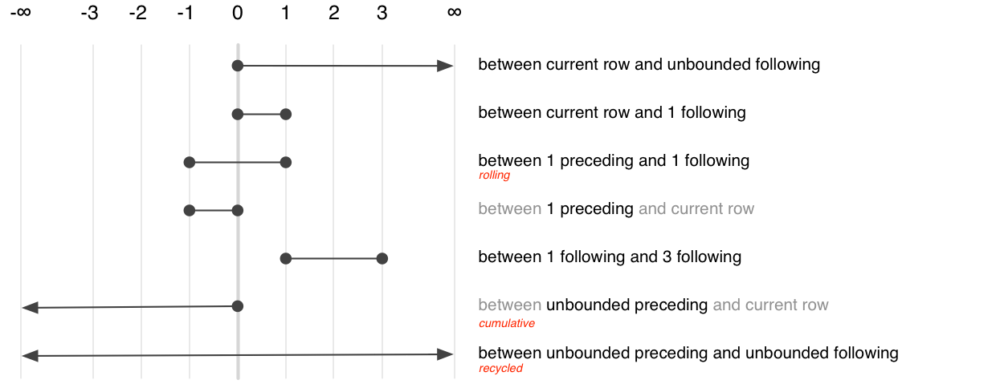
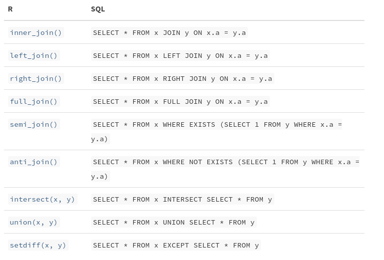

```{r, echo = FALSE}
knitr::opts_chunk$set(warning = FALSE, message = FALSE, out.width = "100%")
```

# {.tabset}
        
## Index

`tidypredict` allows us to run predictions inside the database. It parses a fitted R model object and returns a formula in tidy eval code that calculates the prediction. 

There is also a second package, `modeldb` that fits models inside of a database. modeldb is version 0.1.2 and tidypredict is version 0.3.0. 

## tidypredict 

```{r}
# install 
# install.packages("tidypredict", dependencies = TRUE)
library(tidypredict)
library(tidyverse)
library(magrittr)
```

tidypredict is able to parse an R object, such as 

```{r}
model <- lm(mpg ~ wt, data = mtcars)

# create SQL statement
tidypredict_sql(model, dbplyr::simulate_mssql())
```

### Supported Models 

- linear regression : `lm`
- generalized linear model : `glm`
- random forest models : `randomForest::randomForest`
- random forest models : `ranger::ranger`
- MARS models : `earth::earth`

## modeldb

Fits models inside the database. `modeldb` works with most database backends because it leverages dplyr and dbplyr for the final SQL translation of the algorithm. 

It currently supports : 

- k-means clustering
- linear regression

```{r}
# install
# install.packages("modeldb", dependencies=T)
library(modeldb)
```

### Linear Regression

#### Intro 

An easy way to try it out is by creating a temporary SQLite db and loading mtcars to it. 

```{r}
# set up, connect to, and copy to SQLite DB
con <- DBI::dbConnect(RSQLite::SQLite(), path = ":memory:")
RSQLite::initExtension(con)
dplyr::copy_to(con, mtcars)
```

```{r}
# create model
tbl(con, "mtcars") %>%
    select(wt, mpg, qsec) %>%
    linear_regression_db(wt)
```

#### Intro 2

This section is from the article on linear models. 

A lightweight SQLite database will be used for this article. Additionally, a sample dataset is created. 

```{r}
# copy flights to db
db_flights <- copy_to(con, nycflights13::flights, "flights")

# create a simple sample
db_sample <- db_flights %>%
    filter(!is.na(arr_time)) %>%
    head(20000)
```

#### Model Inside the DB

The `linear_regression_db` function does not use a formula. It uses a table, and a named dependent variable. This means data preparation is needed prior to running the model. The best way to prepare the data is with piped dplyr operations.


```{r}
db_sample %>%
    select(arr_delay, dep_delay, distance) %>%
    linear_regression_db(arr_delay)
```

#### Categorical Variables 

Adding a categorical variable to a model requires prior data transformation. The `add_dummy_variables()` function appends a set of boolean variables, one for each discrete value. This function creates one less discrete variable than the possible values. 

For example, if the categorical variable has three possible values, the function will append two variables. The reason for this is to reduce the number of database operations. Without this step, a fitting function would have to request all of the unique values every time a new model runs, which creates unnecessary processing.

```{r}
db_sample %>%
    select(arr_delay, origin) %>%
    add_dummy_variables(origin, values = c("EWR", "JFK", "LGA"))
```

In a real world scenario, the possible values are usually not known at the beginning of the analysis. It is a good idea to load them into a vector variable so that it can be used any time that variable is added to a model. This can easily be done using the pull command from dplyr:

```{r}
origins <- db_flights %>%
    group_by(origin) %>%
    summarize() %>%
    pull()

origins
```

The `add_dummy_variables` can be used as part of the piped code that terminates in the modeling function,

```{r}
db_sample %>%
    select(arr_delay, origin) %>%
    add_dummy_variables(origin, values = origins) %>%
    linear_regression_db(arr_delay)
```

#### Multiple Linear Regression 

One of two arguments is needed to be set when fitting a model with three or more independent variables. They both relate to the size of the data set used for the model. So either the `sample_size` argument is passed, or the `auto_count` is set to TRUE. When `auto_count` is set to TRUE and no sample size is passed, then the function will do a table count as part of the model fitting. This is done in order to prevent unnecessary database operations, especially for cases when multiple models will be tested on top of the same sample data.

```{r}
db_sample %>%
    select(arr_delay, arr_time, dep_delay, dep_time) %>%
    linear_regression_db(arr_delay, sample_size = 20000)
```

#### Interactions 

Interactions have to be handled manually prior to the modeling step.

```{r}
db_sample %>%
    mutate(distanceXarr_time = distance * arr_time) %>%
    select(arr_delay, distanceXarr_time) %>%
    linear_regression_db(arr_delay, sample_size = 20000)
```

A more typical model would also include the two original variables. 

```{r}
db_sample %>%
    mutate(distanceXarr_time = distance * arr_time) %>%
    select(arr_delay, distance, arr_time, distanceXarr_time) %>%
    linear_regression_db(arr_delay, sample_size = 20000)
```

#### Full Example 

Fitting a model with regular, categorical, and interaction variables will look like this: 

```{r}
remote_model <- db_sample %>%
    mutate(distanceXarr_time = distance * arr_time) %>%
    select(arr_delay, dep_time, distanceXarr_time, origin) %>%
    add_dummy_variables(origin, values = origins) %>%
    linear_regression_db(arr_delay, sample_size = 20000)

remote_model
```

### k-means 

To use the `simple_kmeans_db` function, simply pipe the database backend table to the function. This returns a list object that contains two items:

- A sql query table with the final center assignment 
- A local table with the information about the centers 

```{r}
km <- tbl(con, "mtcars") %>%
    simple_kmeans_db(mpg, wt)

km %>% colnames()
```

The SQL statement from tbl can be extracted using dbplyr's remote_query()

```{r}
dbplyr::remote_query(km)
```

## dbplyr

`dbplyr` is a database backend for `dplyr`. It allows us to use remote database tables as if they are in memory dataframe by automatically converting dplyr code into SQL. 

```{r}
library(dbplyr)
```

`dbplyr` is designed to work with database tables as if they were local data frames. To demonstrate this, we will first create an in memory SQLite database and copy over a dataset: 

```{r}
con <- DBI::dbConnect(RSQLite::SQLite(), ":memory:")
copy_to(con, mtcars)
```

Database connections are coordinated by the [DBI package](https://dbi.r-dbi.org). 

```
The DBI package defines a common interface between the R and database
management systems (DBMS). The interface defines a small set of
classes and methods similar in spirit to Perl’s DBI, Java’s JDBC,
Python’s DB-API, and Microsoft’s ODBC. It defines a set of classes and
methods defines what operations are possible and how they are
performed:

- connect/disconnect to the DBMS 
- create and execute statements in the DBMS 
- extract results/output from statements 
- error/exception handling
- information (meta-data) from database objects 
- transaction management (optional) 

DBI separates the connectivity to the DBMS into a “front-end” and a
“back-end”. Applications use only the exposed “front-end” API. The
facilities that communicate with specific DBMSs (SQLite, MySQL,
PostgreSQL, MonetDB, etc.) are provided by “drivers” (other packages)
that get invoked automatically through S4 methods.
```

There are four main DBI classes. Three which are each extended by
individual database backends:

- DBIObject: a common base class for all DBI.
- DBIDriver: a base class representing overall DBMS properties. Typically generator functions instantiate the driver objects like RSQLite(), RPostgreSQL(), RMySQL() etc.
- DBIConnection: represents a connection to a specific database
- DBIResult: the result of a DBMS query or statement.

All classes are virtual: they cannot be instantiated directly and
instead must be subclassed.

--------

back to dbplyr

--------

We can retrieve a table using `tbl`

```{r}
(mtcars2 <- tbl(con, "mtcars"))
```

All dplyr calls are evaluated lazily, generating SQL that is only sent to the database when you request the data.

```{r}
# lazily generates query
summary <- mtcars2 %>%
    group_by(cyl) %>%
    summarize(mpg = mean(mpg, na.rm = TRUE)) %>%
    arrange(desn(mpg))

# see query
summary %>% show_query()

# execute query and retrieve results
# summary %>% collect()
```

### Get Started 

As well as working with local in memory data stored in data frames, dplyr also works with remote on disk data stored in databases. This is particularly useful in two scenarios: 

- Your data is already in a database
- You have so much data that it doesn't fit into memory simultaneously and we need to use some external storage engine

This vignette focuses on the first scenario. 

#### Getting Started 

To work with specific databases, we may need to install a DBI backend package. 

Five commonly used backends are:

- RMariaDB connects to MySQL and MariaDB

- RPostgres connects to Postgres and Redshift.

- RSQLite embeds a SQLite database.

- odbc connects to many commercial databases via the open database connectivity protocol.

- bigrquery connects to Google’s BigQuery.

#### Connecting to the Database 

To work with a database in dplyr, we must first connect to it. 

The arguments to `DBI::dbConnect` consist of the function to load our specific database (such as `RSQLite::SQLite()`) and the path to the database. For in memory, we can use `:memory:` which causes the db package to make a temporary in memory database. 

Most existing databases don't live in a file, but instead live on another server. Therefore, in real life our code will look more like this: 

```{r}
## con2 <- DBI::dbConnect(RMariaDB::MariaDB(),
##                        host = "database.rstudio.com",
##                        user = "michael",
##                        password = rstudioapi::askForPassword("Database password"))
```

Our temporary database has no data in it, so we'll start by copying over some.

```{r}
copy_to(con, nycflights13::flights, "flights",
  temporary = FALSE, 
  indexes = list(
    c("year", "month", "day"), 
    "carrier", 
    "tailnum",
    "dest"
  ),
  overwrite = TRUE
)
```

Now that we have copied the data, we can use `tbl()` to take a reference to it.

```{r}
flights_db <- tbl(con, "flights")

flights_db
```

The main difference is that we can see that its a remote source in a SQLite database. 

#### Generating Queries 

The goal of dbplyr is to automatically generate SQL for you so that you're not forced to use it. 

```{r}
flights_db %>%
    select(year:day, dep_delay, arr_delay) %>%
    filter(dep_delay > 240)

flights_db %>%
    group_by(dest) %>%
    summarize(delay = mean(dep_time))
```

The most important difference between ordinary data frames and remote database queries is that your R code is translated into SQL and executed in the database on the remote server, not in R on your local machine.

When working with databases, dplyr tries to be as lazy as possible: 

- it never pulls data into R unless you explicitly ask it to
- it delays doing any work until the last possible moment. It collects everything you want to so and then sends it to the database in one step.

```{r}
# example
tailnum_delay_db <- flights_db %>%
    group_by(tailnum) %>%
    summarize(
        delay = mean(arr_delay),
        n = n()
    ) %>%
    arrange(desc(delay)) %>%
    filter(n > 100)

tailnum_delay_db %>% show_query()
```

Once you figure out what data you need from the database, use `collect()` to pull all the data down into a local tibble.

```{r}
(tailnum_delay <- tailnum_delay_db %>% collect())
```

`collect()` requires that the database does some work, so it may take a long time to complete. Otherwise, dplyr tries to prevent you from accidentally performing expensive operations.

- Since there is no way to determine how many rows a query will return unless you actually run it, `nrow()` is always NA
- Since you can't find the last few rows without executing the whole query, you can't use `tail`

```{r}
nrow(tailnum_delay_db)

# tail(tailnum_delay_db)
```

You can also ask the database how it plans to execute the query with `explain()`. The output is database dependent, and can be esoteric, but learning a bit about it can be very useful because it helps you understand if the database can execute the query efficiently or if you need to create new indices.

### Adding a new DBI backend 

To begin:

- make sure you have a DBI compliant database backend. If not, we first need to create it by following the instructions in `vignette("backend", package = "DBI")`

- You need a working knowledge of S3. Basics can be found [Here](http://adv-r.had.co.nz/OO-essentials.html#s3)

#### First Steps

```{r}
library(DBI)

# check that you can create a table from a connection
con <- dbConnect(RSQLite::SQLite(), path = ":memory:")
dbWriteTable(con, "mtcars", mtcars)

tbl(con, "mtcars")
```

If this doesn't work, this likely indicates a problem with the DBI methods. Use [DBItest](https://github.com/r-dbi/DBItest) if this is the case to narrow it down.

Supposing it does work, it is a good time to implement a method for `db_desc`. This should briefly describe the connection, typically formatting the information returned from `dbGetInfo()`. 

This is what dbplyr does for Postgres connections:

```{r}
db_desc.PostgreSQLConnection <- function(x) {
    info <- dbGetInfo(x)
    host <- if (info$host == "") "localhost" else info$host

    paste0("postgres ", info$serverVersion, " [", info$user, "@",
           host, ":", info$port, "/", info$dbname, "]")
}
```

#### Copying, computing, collecting and collapsing

Next, check that copy_to, collapse, compute and collect work. 

- If copy_to() fails, it’s likely you need a method for db_write_table(), db_create_indexes() or db_analyze().

- If collapse() fails, your database has a non-standard way of constructing subqueries. Add a method for sql_subquery().

- If compute() fails, your database has a non-standard way of saving queries in temporary tables. Add a method for db_save_query().

SQL translation

Make sure you’ve read vignette("translation-verb") so you have the lay of the land.

Verbs

Check that SQL translation for the key verbs work:

summarise(), mutate(), filter() etc: powered by sql_select()
left_join(), inner_join(): powered by sql_join()
semi_join(), anti_join(): powered by sql_semi_join()
union(), intersect(), setdiff(): powered by sql_set_op()

Vectors

Finally, you may have to provide custom R -> SQL translation at the vector level by providing a method for sql_translate_env(). This function should return an object created by sql_variant(). See existing methods for examples.

## Functions 

There are two parts to dbplyr SQL translation:

- Translating dplyr verbs 
- Translating expressions within those verbs 

This vignette shows how individual expressions (function calls) are translated. 

```{r}
library(dbplyr)
library(dplyr)
```

```{r}
# simple examples
translate_sql((x + y) / 2)

# example showing optional con parameter
translate_sql(x ^ 2L)
translate_sql(x ^ 2L, con = simulate_sqlite())
translate_sql(x ^ 2L, con = simulate_access())
```

### Basic Differences 


```{r}
# "" and '' mean different things
translate_sql(x)
translate_sql("x")

# some functions have different argument orders
translate_sql(substr(x, 5, 10))
translate_sql(log(x, 10))

# different defaults for ints and reals
translate_sql(1)
translate_sql(1L)
```

### Math Functions 

- basic math operators: +, -, *, /, ^
- trigonometry: acos(), asin(), atan(), atan2(), cos(), cot(), tan(), sin()
- hypergeometric: cosh(), coth(), sinh(), tanh()
- logarithmic: log(), log10(), exp()
- misc: abs(), ceiling(), sqrt(), sign(), round()

### Logic

- logical comparisons: <, <=, !=, >=, >, ==, %in%
- boolean operations: &, &&, |, ||, !, xor()

### Modulo Arithmetic

dbplyr translates %% and %/% to their SQL equivalents, but its worth noting that they are not precisely the same: 

most databases use truncated division, whereras the modulo operator takes the sign of the dividend, where R uses the mathematically preferred floored division with the modulo sign taking the sign of the divisor. 

```{r}
df <- tibble(
    x = c(10L, 10L, -10L, -10L),
    y = c(3L, -3L, 3L, -3L)
)

mf <- src_memdb() %>%
    copy_to(df, overwrite = TRUE)

df %>% mutate(x %% y, x %/% y)

mf %>% mutate(x %% y, x %/% y)
```

### Aggregation 

All databases provide translation for the basic aggregations: mean, sum, min, max, sd, var. Databases automatically drop NULLs, whereas in R we have to ask nicely. The aggregation functions warn us about this

```{r}
# warning
translate_sql(mean(x))

# no warning
translate_sql(mean(x, na.rm = TRUE))

# without the window translation
translate_sql(mean(x, na.rm = TRUE), window = FALSE)
```

### Conditional Evaluation

if and switch are translated to CASE WHEN:

```{r}
translate_sql(if (x > 5) "big" else "small")

translate_sql(switch(x,
                     a = 1L,
                     b = 2L,
                     3L))
```

### String Manipulation 

- string functions: tolower, toupper, trimws, nchar, substr
- coerce types: as.numeric, as.integer, as.character

### Unknown Functions 

Any function that dbplyr doesn't know how to convert is left as is. 

```{r}
translate_sql(glob(x, y))

translate_sql(x %like% "ab%")
```

### Window Functions

SQLs window functions are considerably more expression than the specific variants provided by base R or dplyr. 

They have the form `[expression] OVER ([partition clause] [order clause] [frame clause])`

- The expression is a combination of variable names and window functions. Most support the ranking functions: lead, lag, nth, first, last, count, min, max, sum, avg, stddev 

- The partition clause specifies how the window function is broken down over groups. It plays an analogous role to GROUP BY

- The order clauses controls the ordering (when it makes a difference). This is important for ranking functions since it specifies which variables to rank by, but its also needed for cumulative functions and lead. When thinking about before and after in SQL, we must always tell it which variables define the order. 

- The frame clause defines which rows, or frame, that are passed to the window function, describing which rows should be included. the frame clause provides two offsets which determine the start and end of frame. There are three special values: 
  - \-Inf means to include all the preceeding rows 
  - 0 means the current row 
  - Inf means all following roles 
  
Here is a visual summary: 



To see how individual window functions are translated to SQL:

```{r}
translate_sql(mean(G))

translate_sql(rank(G))

translate_sql(ntile(G, 2))

translate_sql(lag(G))
```

If the tbl has been grouped or arranged previously, then dplyr will use that information to set the partition by and order by clauses.

```{r}
translate_sql(cummean(G), vars_order = "year")

translate_sql(rank(), vars_group = "ID")
```

dplyr tries to keep the window functions as similar as possible to both the existing R analogues and to the SQL functions. This means that there are three ways to control the order clause depending on which window function you're using:

- For ranking functions, the ordering variable is the first argument: rank(x), ntile(y, 2). If omitted or NULL, it will use the default ordering associated with the tbl (as set by arrange())

- Accumulating aggregates only take a single argument (the vector to aggregate). To control ordering use `order_by`

- Aggregates implemented in dplyr (lead, lag, nth_value, first_value, last_value) have an order by argument. Supply it to override the default ordering.

The three options are illustrated below: 

```{r}
## mutate(players,
##        min_rank(yearID),
##        order_by(yearID, cumsum(G)),
##        lead(G, order_by = yearID))
```

Currently, as of June 16th, 2019, there is no way to order multiple variables except by setting the default ordering with arrange. This will be added in a future release. 

## Verbs 

All dplyr verbs generate a SELECT statement. 

```{r}
con <- DBI::dbConnect(RSQLite::SQLite(), ":memory:")

flights <- copy_to(con, nycflights13::flights)
airports <- copy_to(con, nycflights13::airports)
```

### Single Table Verbs 

select and mutate modify the SELECT clause:

```{r}
flights %>%
    select(contains("delay")) %>%
    show_query()

flights %>%
    select(distance, air_time) %>%
    mutate(speed = distance / (air_time / 60)) %>%
    show_query()
```

filter generates a WHERE clause

```{r}
flights %>%
    filter(month == 1, day == 1) %>%
    show_query()
```

arrange generates an ORDER BY clause 

```{r}
flights %>%
    arrange(carrier, desc(arr_delay)) %>%
    show_query()
```

summarise and group_by work together to generate a GROUP BY clause

```{r}
flights %>%
    group_by(month, day) %>%
    summarise(delay = mean(dep_delay)) %>%
    show_query()
```

### Dual Table Verbs 



### Behind the Scenes 

The verb level SQL translation is implemented on top of tbl_lazy, which basically tracks the operations you perform in a pipeline. Turning that into a SQL query takes place in three steps:

- sql_build recurses over the lazy op data structure building up query objects (select_query, join_query, set_op_query, etc) that represent the different subtypes of SELECT queries we might generate 

- sql_optimise takes a pass over these SQL objects, looking for potential optimizations. Currently this only involves removing subqueries where possible 

- sql_render calls a SQL generation function (sql_select, sql_join, sql_subquery, sql_semijoin, etc) to produce the actual SQL. Each of these functions is a generic, taking the connection as an argument, so that the details can be customized for different databases.

